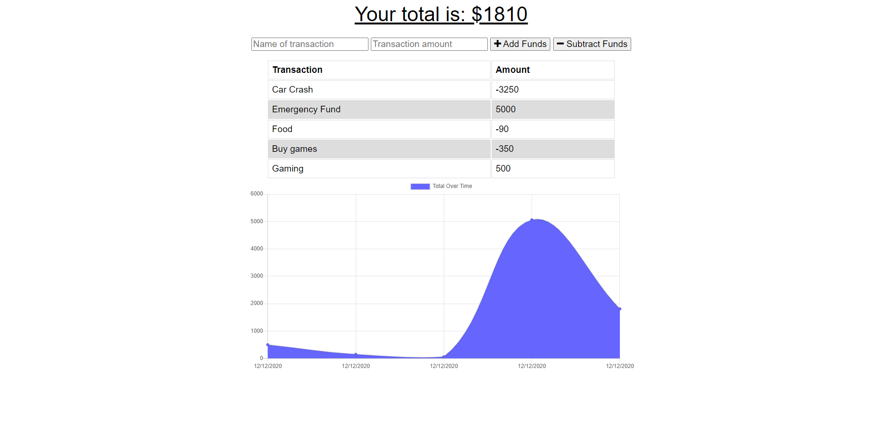

# Budget-Trackers

## Description

This is the homework for week eighteen. The purpose is to create an application that allows users to enter deposits and expenses to a budget whether the users are online or not. If the users make deposits and withdrawals offline, then these entries should be added to the tracker after the connection is online again.

## Installation

In the terminal, use the following commands:

* `npm install express`
* `npm install morgan`
* `npm install mongoose`
* `npm install compression`

## Screenshots

## Links

* https://github.com/LostandConfusedStudent/Budget-Trackers
* 